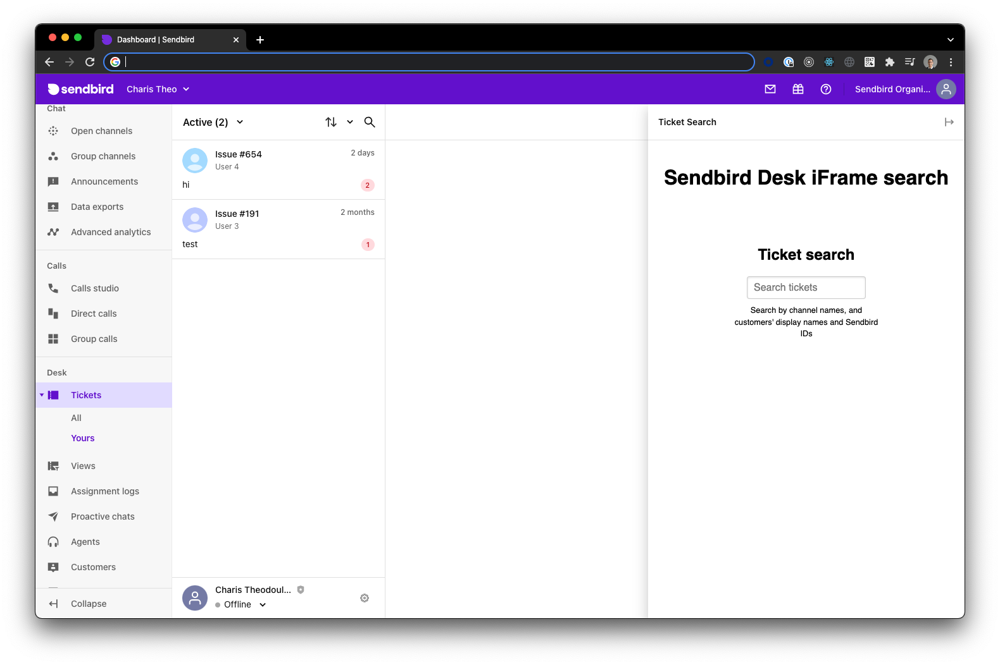

# Sendbird Desk ticket search iframe

> This is a simple demo website that when hosted can be used within an iframe inside of [Sendbird Desk](https://sendbird.com/features/customer-support) dashboard to provide ticket search functionality for agents.

> This demo is making use of this [Platform API endpoint](https://sendbird.com/docs/desk/v1/platform-api/guides/ticket#2-list-tickets) only for searching Sendbird Desk tickets.

## Setup

1. Host the `index.html` and `index.js` files anywhere that are publicly accessible (for testing you can even use [ngrok](https://ngrok.com/))

    > ⚠️ Make sure you add the _full_ URL to the path of the `index.js` file when importing it inside of `index.html` otherwise it will not be found from within the iframe!
    > i.e. ``

2. Add the hosting URL from above, in [Sendbird Dashboard](https://dashboard.sendbird.com/) under Application **Settings** > **Desk** > **Integrations** > Iframe sidebar - **Add iFrame +** > **URL** and hit '**Save**'

    

3. Navigate to your tickets page, under **Desk** > **Tickets** > **Yours** and open the iframe from the sidebar on the right

    
